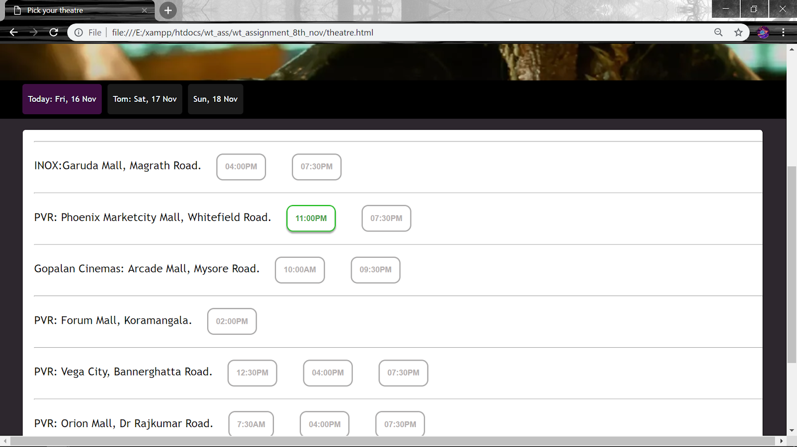

# Movie Booking

## Project Description
The project is an online movie booking website where a user can register, login, and book tickets for a movie of their choice. The user can choose the language of the movie, the date and timings of the movie, the theatre in which they want to watch it and the seats of their choice after which the seats become unavailable for the next user. The bill and ticket is generated at the end.

The project demonstrates the use of different web technologies through which we can make a web-page more dynamic.  

[Link to complete writeup.](https://docs.google.com/document/d/1YGr4ltsmtw51byYvjh03-SYOhmHaaqsmZAx-nDSdkWg/edit?usp=sharing)

#### Technologies Used
The Different web technologies used in our project are

* Java-script
* CSS
* HTML  and HTML5 tags
* PHP
* MySQL
* DOM
* LocalStorage
* Geo-location

## Screenshots

# Login Page

# Movie Choices Page

# Theatres Page

# Seat Matrix Page

# Ticket Page

